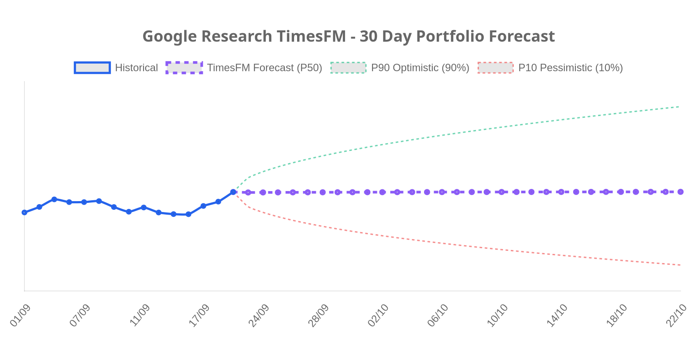

# 📈 Stock Tracker & Portfolio Analytics | מעקב תיק השקעות

> **מערכת חכמה לניהול ומעקב תיק השקעות בזמן אמת המשולבת במודל חיזוי סדרות עתיות Google Research TimesFM.** 
> כוללת חישובי מס רווחי הון (25%), המרות מט"ח, יומן דיבידנדים היסטורי, מנוע זיהוי אנומליות וחיזוי מבוסס AI.
> 👉 **[למעבר לדשבורד המלא והאינטראקטיבי לחץ כאן](https://almog787.github.io/My-new-stock-trucker/)**

---

## 📊 תמונת מצב (Executive Snapshot)

* **שווי תיק נוכחי:** `₪186,551` (`$61,774`)
* **רווח כולל נטו (לאחר 25% מס):** `+₪41,890` (**+32.36%**)
* **שינוי יומי:** `+₪3,478` (**+1.90%**)
* **הכנסה פאסיבית חודשית ממוצעת (YTD):** `+₪1,903/חודש` נטו
* **סך דיבידנדים (12M):** `₪661` נטו
* **מועד עדכון אחרון:** `22/09/2026 01:27` (שער רציף: `₪3.020`)

---

## 🔮 תחזיות מודל Google Research TimesFM (AI Forecasting & Analytics)

* **יעד שווי תיק צפוי בעוד 30 יום (P50):** `₪186,802` (`$61,855`)
* **טווח הסתברותי (P10 - P90):** `₪152,991` עד `₪228,316`
* **תשואת תיק צפויה (30d Expected Return):** `+0.13%` (תנודתיות שנתית חזויה: `26.8%`)
* **תחזית שער דולר/שקל (30 יום):** `₪3.020` (טווח: `₪2.880 - ₪3.170`)

### 🎯 מטריצת תחזיות ואותות למניות התיק:
| מניה (Asset) | שער נוכחי | יעד צפוי 30 יום (P50) | טווח ביטחון (P10 - P90) | תשואה חזויה | אות מודל (AI Signal) |
| :--- | :---: | :---: | :---: | :---: | :---: |
| **GOOGL** | `$354.97` | `$354.51` | `$293.45 - $428.27` | **-0.13%** | 🔴 דשדוש / ניטרלי |
| **ASML** | `$1711.32` | `$1691.24` | `$1304.74 - $2192.22` | **-1.17%** | 🔴 דשדוש / ניטרלי |
| **XOM** | `$158.30` | `$163.31` | `$139.61 - $191.03` | **+3.16%** | 🟢 מגמה חיובית מתונה |
| **NVDA** | `$227.38` | `$231.46` | `$171.98 - $311.53` | **+1.79%** | 🟢 מגמה חיובית מתונה |
| **TSLA** | `$375.30` | `$367.99` | `$266.13 - $508.83` | **-1.95%** | 🔴 דשדוש / ניטרלי |
| **VOO** | `$712.78` | `$717.37` | `$661.34 - $778.14` | **+0.64%** | 🟢 מגמה חיובית מתונה |

---

## 📋 ביצועי מניות והחזקות (Holdings Performance)

| נכס (Asset) | כמות | שער נוכחי | שווי שוק | שינוי יומי (Daily Change) | שינוי מהכניסה לתיק (Total Return) |
| :--- | :---: | :---: | :---: | :---: | :---: |
| **GOOGL**  Alphabet (Google) | 48 | $354.97 | ₪51,455  ($17,039) | 🟢 +1.55%  +₪787 | 🟢 +88.82%  +₪24,205 |
| **ASML**  ASML Holding | 4 | $1711.32 | ₪20,672  ($6,845) | 🟢 +1.87%  +₪379 | 🟢 +83.12%  +₪9,384 |
| **XOM**  Exxon Mobil | 2 | $158.30 | ₪956  ($317) | 🔴 -3.20%  ₪-32 | 🟢 +25.56%  +₪195 |
| **NVDA**  NVIDIA Corp | 57 | $227.38 | ₪39,140  ($12,961) | 🟢 +2.30%  +₪880 | 🟢 +52.99%  +₪13,557 |
| **TSLA**  Tesla Inc | 20 | $375.30 | ₪22,667  ($7,506) | 🟢 +3.03%  +₪666 | 🔴 -14.01%  ₪-3,693 |
| **VOO**  Vanguard S&P 500 | 24 | $712.78 | ₪51,661  ($17,107) | 🟢 +1.57%  +₪797 | 🟢 +35.15%  +₪13,437 |

---

## 📈 גרפים ומגמות (Visual Analytics)

 

 

> 💡 *לפירוט החזקות מלא, סימולטור תרחישים, זיהוי אנומליות וגרפים אינטראקטיביים, יש להיכנס ל-[דשבורד המערכת](https://almog787.github.io/My-new-stock-trucker/).*

---
📂 *Portfolio Tracker Engine & TimesFM AI Analytics by Almog787*
