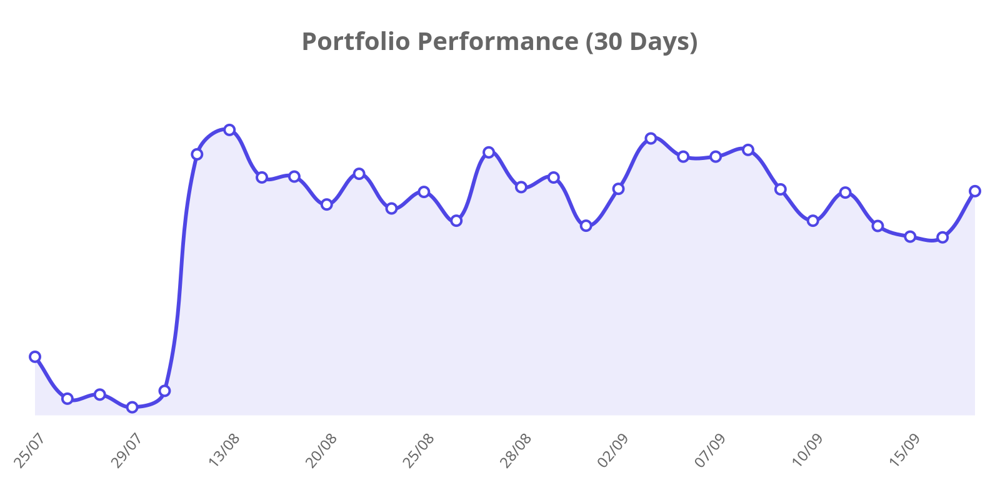
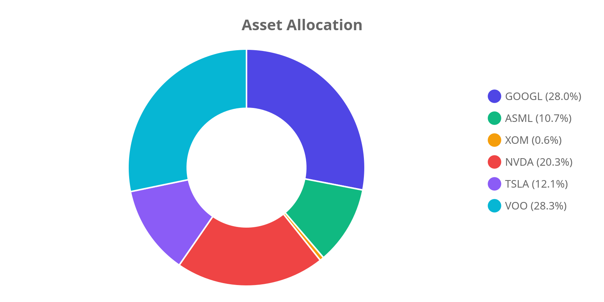

# 📊 Portfolio Dashboard | מעקב תיק השקעות

[🚀 **View Interactive Web Dashboard**](https://almog787.github.io/My-new-stock-trucker-/)

  

**Last Update:** 08/08/2026 10:24 | **USD/ILS:** ₪3.006

## 💰 Portfolio Summary | סיכום התיק
| Metric | Value | נתון |
| :--- | :--- | :--- |
| **Current Value** | `₪182,382` | **שווי נוכחי** |
| **Total Invested** | `₪128,875` | **סך השקעה** |
| **Total Profit/Loss** | `+41.52%` (₪53,507) | **רווח/הפסד כולל** |
| **Daily Change** | `+0.91%` | **שינוי יומי** |

## 📜 Holdings | פירוט החזקות
| Ticker | Shares | Avg. Cost | Current Price | P&L % | P&L ILS |
| :--- | :--- | :--- | :--- | :--- | :--- |
| GOOGL | 48 | $187.99 | $354.30 | 🟢 +88.47% | ₪23,997 |
| ASML | 4 | $934.51 | $1,740.99 | 🟢 +86.30% | ₪9,697 |
| XOM | 2 | $126.08 | $153.04 | 🟢 +21.38% | ₪162 |
| NVDA | 57 | $148.62 | $223.96 | 🟢 +50.69% | ₪12,909 |
| TSLA | 20 | $436.45 | $328.58 | 🔴 -24.72% | ₪-6,485 |
| VOO | 24 | $527.38 | $710.71 | 🟢 +34.76% | ₪13,227 |

## 📈 Charts | גרפים

---
📂 *Created by Almog787*
