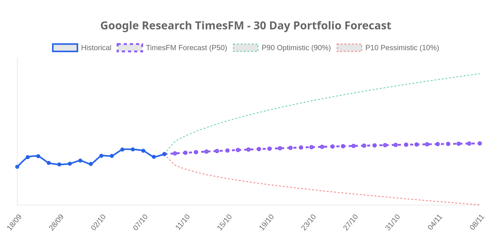
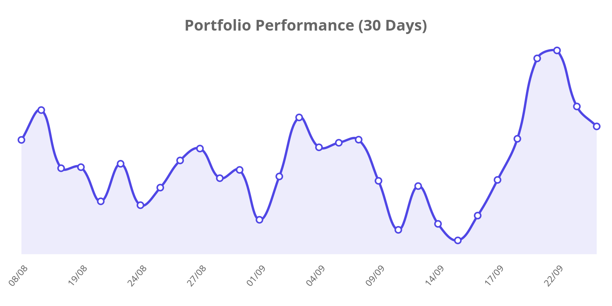
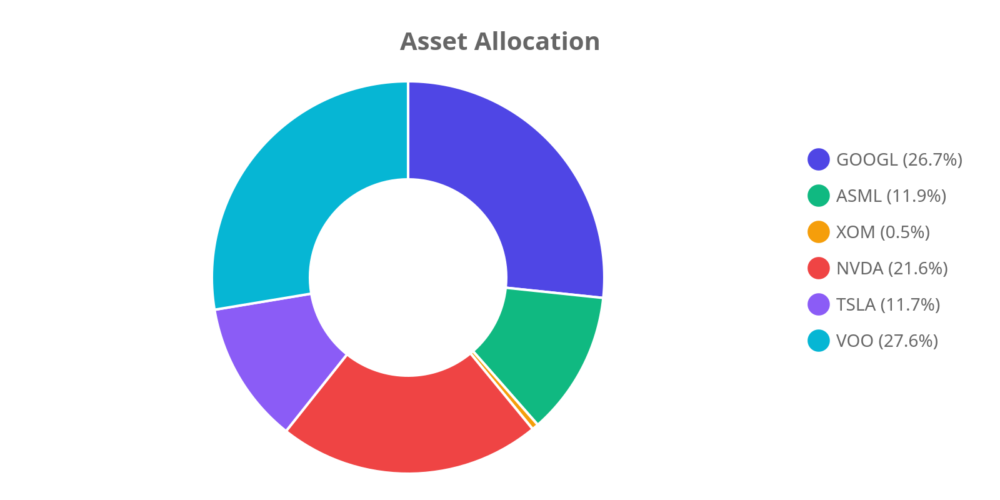

# 📈 Stock Tracker & Portfolio Analytics | מעקב תיק השקעות

> **מערכת חכמה לניהול ומעקב תיק השקעות בזמן אמת המשולבת במודל חיזוי סדרות עתיות Google Research TimesFM.** 
> כוללת חישובי מס רווחי הון (25%), המרות מט"ח, יומן דיבידנדים היסטורי, מנוע זיהוי אנומליות וחיזוי מבוסס AI.
> 👉 **[למעבר לדשבורד המלא והאינטראקטיבי לחץ כאן](https://almog787.github.io/My-new-stock-trucker/)**

---

## 📊 תמונת מצב (Executive Snapshot)

* **שווי תיק נוכחי:** `₪189,835` (`$62,013`)
* **רווח כולל נטו (לאחר 25% מס):** `+₪42,940` (**+32.72%**)
* **שינוי יומי:** `+₪3,424` (**+1.84%**)
* **הכנסה פאסיבית חודשית ממוצעת (YTD):** `+₪1,791/חודש` נטו
* **סך דיבידנדים (12M):** `₪674` נטו
* **מועד עדכון אחרון:** `02/10/2026 22:25` (שער רציף: `₪3.061`)

---

## 📋 ביצועי מניות והחזקות (Holdings Performance)

| נכס (Asset) | כמות | שער נוכחי | שווי שוק | שינוי יומי (Daily Change) | שינוי מהכניסה לתיק (Total Return) |
| :--- | :---: | :---: | :---: | :---: | :---: |
| **GOOGL**  Alphabet (Google) | 48 | $343.50 | ₪50,473  ($16,488) | 🟢 +1.56%  +₪773 | 🟢 +82.72%  +₪22,850 |
| **ASML**  ASML Holding | 4 | $1867.31 | ₪22,865  ($7,469) | 🟢 +3.25%  +₪720 | 🟢 +99.82%  +₪11,422 |
| **XOM**  Exxon Mobil | 2 | $164.01 | ₪1,004  ($328) | 🟢 +0.12%  +₪1 | 🟢 +30.08%  +₪232 |
| **NVDA**  NVIDIA Corp | 57 | $233.95 | ₪40,822  ($13,335) | 🟢 +1.34%  +₪539 | 🟢 +57.41%  +₪14,889 |
| **TSLA**  Tesla Inc | 20 | $370.59 | ₪22,689  ($7,412) | 🟢 +4.65%  +₪1,009 | 🔴 -15.09%  ₪-4,032 |
| **VOO**  Vanguard S&P 500 | 24 | $707.54 | ₪51,982  ($16,981) | 🟢 +0.74%  +₪381 | 🟢 +34.16%  +₪13,236 |

---

## 🔮 תחזיות מודל Google Research TimesFM (AI Forecasting & Analytics)

* **יעד שווי תיק צפוי בעוד 30 יום (P50):** `₪192,277` (`$62,631`)
* **טווח הסתברותי (P10 - P90):** `₪158,062` עד `₪233,262`
* **תשואת תיק צפויה (30d Expected Return):** `+1.00%` (תנודתיות שנתית חזויה: `25.1%`)
* **תחזית שער דולר/שקל (30 יום):** `₪3.070` (טווח: `₪2.910 - ₪3.230`)

### 🎯 מטריצת תחזיות ואותות למניות התיק:
| מניה (Asset) | שער נוכחי | יעד צפוי 30 יום (P50) | טווח ביטחון (P10 - P90) | תשואה חזויה | אות מודל (AI Signal) |
| :--- | :---: | :---: | :---: | :---: | :---: |
| **GOOGL** | `$343.50` | `$342.76` | `$283.42 - $414.54` | **-0.22%** | 🔴 דשדוש / ניטרלי |
| **ASML** | `$1867.31` | `$1897.23` | `$1467.39 - $2453.00` | **+1.60%** | 🟢 מגמה חיובית מתונה |
| **XOM** | `$164.01` | `$168.22` | `$144.57 - $195.75` | **+2.57%** | 🟢 מגמה חיובית מתונה |
| **NVDA** | `$233.95` | `$242.07` | `$186.15 - $314.79` | **+3.47%** | 🟢 מגמה חיובית מתונה |
| **TSLA** | `$370.59` | `$368.23` | `$265.91 - $509.92` | **-0.64%** | 🔴 דשדוש / ניטרלי |
| **VOO** | `$707.54` | `$713.46` | `$658.63 - $772.85` | **+0.84%** | 🟢 מגמה חיובית מתונה |

---

## 📈 גרפים ומגמות (Visual Analytics)

 

 

> 💡 *לפירוט החזקות מלא, סימולטור תרחישים, זיהוי אנומליות וגרפים אינטראקטיביים, יש להיכנס ל-[דשבורד המערכת](https://almog787.github.io/My-new-stock-trucker/).*

---
📂 *Portfolio Tracker Engine & TimesFM AI Analytics by Almog787*
